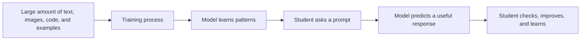

# Day 1: Meet AI, Your New Study Partner

## Opening story: The library that learned to talk

Imagine walking into a huge library. Every shelf is full of books. There are science books, history books, grammar books, coding books, stories, maps, solved examples, and exam papers. Now imagine that the library can talk back to you.

You ask, "Why does the moon change shape?"

The library does not just point to one book. It tries to combine information from many patterns it has learned and gives you an explanation. It may even ask, "Do you want the answer like a story, a diagram, or a quiz?"

That talking library is a simple way to imagine modern AI.

But there is one important difference. A real library stores books. AI does not simply open one exact book in its mind. It predicts helpful answers based on patterns it learned during training and sometimes from tools connected to it. Because of that, AI can be helpful, but it can also be wrong.

## What AI is

Artificial Intelligence is technology that can perform tasks that usually need human-like thinking. These tasks may include reading, writing, recognizing images, translating language, answering questions, summarizing, classifying, planning, generating ideas, writing code, and making predictions.

A simple definition:

> AI is a computer system that can learn patterns and use those patterns to help with tasks.

## What AI is not

AI is not a real human friend. It does not have feelings like you do. It does not understand life the way a parent, teacher, or close friend understands life. It does not automatically know what is true. It can sound confident even when it is wrong.

| AI can do | AI cannot safely do alone |
|---|---|
| Explain a chapter in simple language | Decide what is true without verification |
| Create practice questions | Replace your teacher |
| Help you brainstorm | Replace your own thinking |
| Make a revision plan | Guarantee exam marks |
| Help organize notes | Know your school rules unless you tell it |

## Three levels of understanding

### Junior Explorer: Grade 3 to 5

AI is like a smart helper on a computer. You can ask it questions. It can tell stories, explain words, make quizzes, and help you learn. But you must ask an adult before using it and you must not tell it private things.

### Middle Builder: Grade 6 to 8

AI is a tool that predicts useful responses. It is excellent for learning when you ask clear questions. You can use it to revise, make flashcards, explain topics, and plan projects. You must check answers and avoid copying.

### Senior Innovator: Grade 9 to 12

AI is part of a larger technological shift. It is changing how people research, write, code, analyze data, design presentations, learn languages, prepare for exams, and build businesses. Your advantage will not come from simply using AI. It will come from using AI ethically, critically, and creatively.

## How AI learns: a simplified diagram



## Important idea: AI predicts, students decide

When you type a question, AI tries to predict what answer would be useful. It does not always know whether the answer is perfect. That is why the student has a new responsibility.

The new learning formula is:

```text
Ask clearly + Think carefully + Verify facts + Apply honestly = Smart AI learning
```

## Activity 1: AI or not AI

Write whether each example uses AI or probably does not use AI.

| Example | AI or not AI? | Why? |
|---|---|---|
| A calculator adding 25 + 36 |  |  |
| A phone unlocking using face recognition |  |  |
| A grammar app suggesting a better sentence |  |  |
| A washing machine timer |  |  |
| A chatbot explaining photosynthesis |  |  |
| A video platform recommending the next video |  |  |

## Activity 2: Explain AI to three people

Explain AI in three different ways:

1. To a Grade 3 student.
2. To your parent.
3. To a school principal.

This teaches you that communication changes based on the audience.

## AI as a friend: the healthy meaning

When we say "AI like a friend," we do not mean that AI replaces real friends. We mean it can be friendly to learn with.

A healthy AI study friend can:

- Ask you questions.
- Explain patiently.
- Give you examples.
- Help you practice.
- Help you organize notes.
- Encourage you to try again.

An unhealthy use of AI would be:

- Copying homework without understanding.
- Believing everything AI says.
- Sharing private details.
- Using AI secretly against school rules.
- Depending on AI for every small thought.

## The world is changing

Earlier, many students studied like this:

```text
Read textbook -> Make notes -> Ask teacher if stuck -> Revise before exam
```

Now students can study like this:

```text
Read textbook -> Ask AI for simple explanation -> Create quiz -> Test yourself -> Find weak areas -> Ask teacher better questions -> Revise smarter
```

The best students will not stop reading. They will read better. They will not stop thinking. They will think deeper. They will not stop asking teachers. They will ask better questions.

## How learning is changing

| Old habit | AI-supported upgrade |
|---|---|
| Passive reading | Ask AI to quiz you after reading. |
| Memorizing without understanding | Ask for examples, analogies, diagrams, and misconceptions. |
| Waiting for tuition to clear doubts | First ask AI, then ask teacher if still confused. |
| Making the same mistakes | Maintain an AI-assisted mistake notebook. |
| Last-minute revision | Build daily micro-revision plans. |
| One explanation for everyone | Ask for explanations at your level. |

## First safe prompt

Copy this prompt into an AI tool with a topic you are studying:

```text
Act as a patient teacher. Explain [topic name] in simple language. Use one real-life example, one small diagram in text form, and then ask me three questions to check if I understood. Do not give very long answers.
```

## Day 1 reflection

Answer these in your notebook:

1. What is one thing AI can help me learn better?
2. What is one thing AI should not do for me?
3. What private information should I never share with AI?
4. How can I use AI without cheating?

## Day 1 mission

Teach one family member what AI is in less than two minutes. Use the talking library story if it helps.


## Tools mentioned in this book

| Tool | Useful for students | Important caution |
|---|---|---|
| ChatGPT | Explanations, quizzes, writing help, brainstorming, coding support, revision plans | Verify facts and do not paste private information. |
| Microsoft Copilot | Web-connected help, writing, Microsoft ecosystem support, browser assistance | Check school policy before using it for assignments. |
| Google Gemini | Brainstorming, summaries, multimodal help, Google ecosystem support | Do not rely on one answer; cross-check. |
| DeepSeek | Reasoning, coding help, explanations, document chat in supported contexts | Be careful with sensitive files. |
| Perplexity | Research-style search with sources | Read the sources, not just the summary. |
| NotebookLM | Learning from uploaded notes or sources | Upload only safe, non-private study material. |
| Gamma | Presentations, visual documents, project reports | Do not let design hide weak understanding. |
| Canva | Posters, infographics, visual summaries | Respect copyright and image usage rights. |
| Napkin AI | Turning ideas into diagrams and visual maps | Check that diagrams actually match the topic. |
