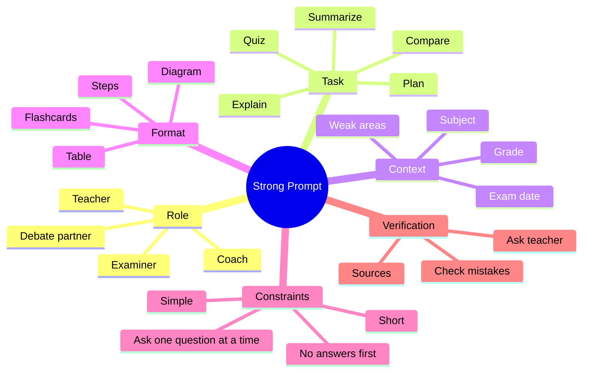

# Day 2: Prompt Engineering, or How to Ask Better Questions

## Opening story: The genie who needs instructions

Imagine you meet a genie. The genie is powerful, but there is a problem. It does not know exactly what you want unless you explain clearly.

You say, "Help me with science."

The genie gets confused. Which chapter? Which grade? Do you need notes, a quiz, a story, a diagram, or exam answers?

Now you say:

```text
Act as my Grade 7 science tutor. Explain the water cycle in simple language. Use a small flow diagram, give two real-life examples, and ask me five quiz questions one at a time.
```

Now the genie knows what to do.

That is prompting.

## What is a prompt

A prompt is the instruction you give to an AI system.

A weak prompt is unclear:

```text
Explain maths.
```

A strong prompt gives direction:

```text
Act as a friendly Grade 8 maths teacher. Explain linear equations using a shopkeeper example. Show two solved examples and then give me three practice questions without answers first.
```

## The AI Skillverse Prompt Formula

Use this formula:

```text
Role + Task + Context + Format + Level + Constraints + Check
```

| Part | Meaning | Example |
|---|---|---|
| Role | Who should AI act like? | Act as a Grade 8 science tutor. |
| Task | What should AI do? | Explain this topic. |
| Context | What background should it know? | I have an exam on Friday. |
| Format | How should the answer look? | Use a table and bullets. |
| Level | What difficulty level? | Explain like I am 11 years old. |
| Constraints | What should it avoid or include? | Avoid long paragraphs. |
| Check | How should it test you? | Ask me 5 questions at the end. |

## Diagram: prompt engineering map



## Prompt ladder: make any prompt better

### Level 1: Basic

```text
Explain fractions.
```

### Level 2: Better

```text
Explain fractions to a Grade 5 student using pizza examples.
```

### Level 3: Strong

```text
Act as my Grade 5 maths tutor. Explain fractions using pizza and chocolate examples. First explain numerator and denominator, then show three examples, then ask me five questions one at a time. Do not give the answer until I try.
```

### Level 4: Exam-ready

```text
Act as my Grade 5 maths tutor and examiner. Teach me fractions using simple examples. Then give me a 10-question quiz with easy, medium, and hard questions. Wait for my answers one by one. After each answer, explain my mistake and give me one similar question for practice.
```

## Student activity: repair the weak prompt

Improve each weak prompt.

| Weak prompt | Your improved prompt |
|---|---|
| Teach history. |  |
| Make notes. |  |
| Help exam. |  |
| Explain coding. |  |
| Make presentation. |  |

## Prompt patterns every student should know

### 1. Tutor mode

```text
Act as my personal tutor for [subject]. Teach me [topic] from basics. Use simple examples. After every section, ask me one question to check understanding.
```

### 2. Quiz mode

```text
Create a quiz on [topic]. Ask one question at a time. Do not show the answer until I answer. Keep score and explain mistakes.
```

### 3. Mistake coach mode

```text
I solved this problem but got it wrong. Do not give the answer immediately. First identify where my thinking went wrong, then guide me step by step.
```

### 4. Exam planner mode

```text
I have an exam on [date]. My chapters are [list]. I can study [time] per day. Make a realistic revision plan with practice questions and daily review.
```

### 5. Presentation coach mode

```text
Help me prepare a 5-minute presentation on [topic]. Give me an outline, slide titles, simple speaking notes, and one audience question I should be ready to answer.
```

## Advanced prompt technique: ask AI to ask you questions first

Many students give AI too little information. A powerful trick is to make AI interview you first.

```text
I want help with [task]. Before answering, ask me up to five questions that will help you give a better response. Ask only the most important questions.
```

## Advanced prompt technique: compare answers

For important topics, do not ask only one AI tool and stop. Compare.

```text
Explain [topic] in simple language. Then list three things students often misunderstand. Finally, tell me what I should verify from my textbook.
```

## The danger of lazy prompting

Lazy prompting creates lazy thinking.

If a student writes:

```text
Do my homework.
```

The student may get an answer, but lose learning.

A better prompt is:

```text
Guide me through this homework question. Ask me what I think first. Give hints step by step. Do not write the final answer until I have tried.
```

## Day 2 challenge: build your prompt bank

Create a file or notebook page called `My AI Prompt Bank`. Add prompts for:

1. Explaining a topic.
2. Making a quiz.
3. Checking grammar.
4. Planning exam revision.
5. Creating a project idea.
6. Asking for a diagram.
7. Learning vocabulary.
8. Practicing an interview or viva.

## Day 2 reflection

1. What makes a prompt strong?
2. What is the difference between "answer me" and "teach me"?
3. Why should AI ask you questions before helping with a big task?
4. Which prompt will you use most often?
