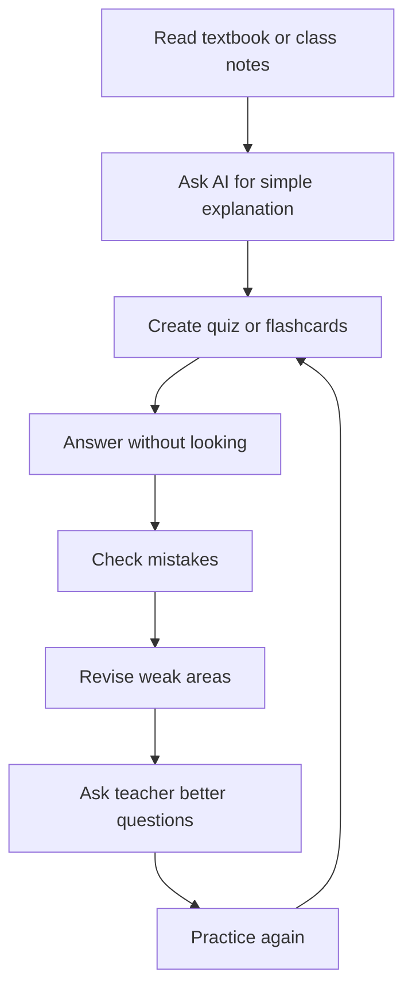

# Day 3: AI for Studying, Exams, and Revision

## Opening story: The student who stopped rereading and started testing

A student reads the same chapter five times. It feels familiar, so the student thinks, "I know this." But in the exam, the questions look different and the student gets stuck.

Another student reads the chapter once, asks AI to create questions, answers without looking, checks mistakes, and revises weak points. This student may study fewer hours but with more attention.

The difference is active learning.

AI is powerful when it helps you practice, not when it helps you avoid practice.

## The AI Study Loop



## How exam preparation is changing

Earlier, students often asked:

```text
How many hours should I study?
```

Now the better question is:

```text
How many times did I test myself, fix mistakes, and revise weak areas?
```

AI can help you do this daily.

## Study workflow for any chapter

### Step 1: Preview

Ask AI:

```text
I am starting the chapter [chapter name] from Grade [grade] [subject]. Give me a simple preview: main ideas, key terms, and what I should pay attention to while reading. Keep it short.
```

### Step 2: Read the real source

Read your textbook, teacher notes, or school material. AI should support the source, not replace it.

### Step 3: Simplify

```text
Explain this topic in simple language. Use one example from daily life and one small text diagram.
```

### Step 4: Active recall

```text
Ask me 10 questions from this chapter one at a time. Mix one-word, short answer, application, and reasoning questions. Do not show answers until I try.
```

### Step 5: Mistake notebook

```text
Here are the questions I got wrong: [paste questions]. Identify my weak concepts and make a 20-minute revision plan.
```

## Building a mistake notebook

A mistake notebook is more valuable than a beautiful notebook. It tells you what to fix.

| Date | Subject | Question type | Mistake | Correct idea | Next practice date |
|---|---|---|---|---|---|
|  |  |  |  |  |  |

Prompt:

```text
Turn my mistakes into a mistake notebook table. Columns: topic, type of mistake, why I made it, correct method, one similar practice question.
```

## Flashcards with AI

Flashcards help with memory.

Prompt:

```text
Create 20 flashcards from [topic]. Format as Question | Answer | Memory trick. Keep answers short.
```

For younger students:

```text
Create 10 simple flashcards for Grade 4 on [topic]. Use easy words and one fun example for each.
```

For older students:

```text
Create flashcards for [topic] with definitions, formulas, common mistakes, and exam-style applications.
```

## AI for different subjects

| Subject | How AI can help | What student must still do |
|---|---|---|
| Mathematics | Step-by-step hints, similar practice questions, formula explanation | Solve by hand and check steps. |
| Science | Diagrams, analogies, quizzes, concept maps | Learn textbook definitions and draw diagrams. |
| Social Science | Timelines, cause-effect tables, map practice ideas | Memorize key dates, terms, and school-specific answers. |
| English | Grammar feedback, essay structure, vocabulary practice | Write your own final answer. |
| Languages | Conversation practice, translation checking, vocabulary | Practice speaking and writing yourself. |
| Coding | Debugging hints, explanation of errors, project ideas | Run code, understand logic, and write your own code. |

## Exam planning prompt

```text
I have exams starting on [date]. Subjects: [list]. Chapters: [list]. I can study [number] hours on weekdays and [number] hours on weekends. Make a realistic study plan that includes reading, active recall, practice questions, revision, and breaks. Do not make the schedule impossible.
```

## Past-paper practice

For senior students:

```text
Act as an examiner. Based on this syllabus: [paste syllabus], create a practice paper with marks distribution. Then create a marking scheme. Do not make the questions too easy.
```

After solving:

```text
Evaluate my answer using the marking scheme. Tell me what marks I may lose and how to improve. Be strict but fair.
```

## The 25-minute AI study sprint

Use this when you feel stuck.

| Minute | Task |
|---|---|
| 0 to 3 | Tell AI the topic and ask for a simple overview. |
| 3 to 10 | Read textbook or notes. |
| 10 to 17 | Ask AI to quiz you. |
| 17 to 22 | Correct mistakes. |
| 22 to 25 | Write a tiny summary from memory. |

## Activity: build your exam command center

Create a table for one subject:

| Chapter | Confidence 1 to 5 | Last revised | Mistakes found | Next action |
|---|---|---|---|---|
|  |  |  |  |  |

Then ask AI:

```text
Based on this table, tell me which chapter to revise first and why. Give me a 3-day plan.
```

## Warning: AI can make you feel prepared when you are not

Reading an AI explanation is not the same as being ready. You are ready only when you can answer questions without looking.

Use this rule:

```text
If I cannot explain it without AI, I have not learned it yet.
```

## Day 3 reflection

1. What is active recall?
2. How can AI help you find weak areas?
3. Why is a mistake notebook useful?
4. What is one subject where you will use AI this week?
