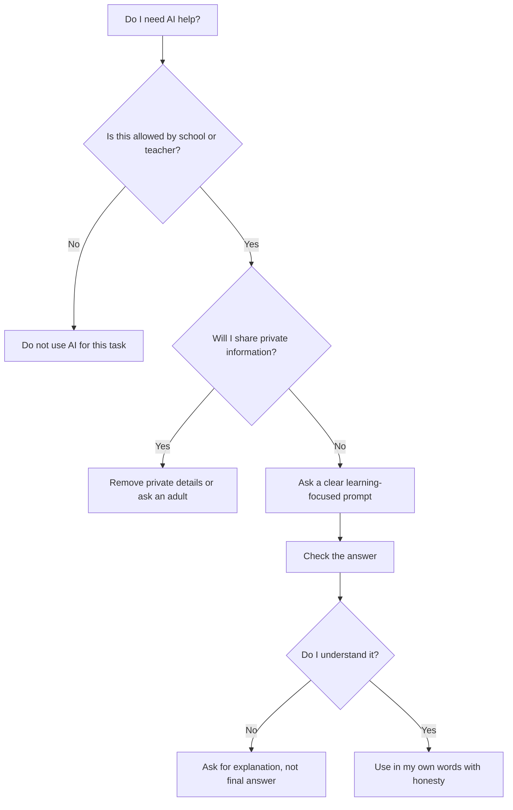
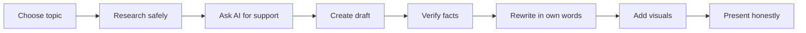

# Day 5: Ethics, Safety, Future Skills, and Final Showcase

## Opening story: The powerful bicycle

Imagine you get a powerful bicycle. It can go faster than your old one. You can reach school quicker. You can explore new places. But if you ride without brakes, ignore traffic, or close your eyes, the bicycle becomes dangerous.

AI is similar. It gives speed, but speed needs responsibility.

## The AI Skillverse Responsible AI Rule

```text
Use AI to learn, create, and improve.
Do not use AI to cheat, harm, mislead, or avoid thinking.
```

## The main dangers students must understand

| Danger | What it means | Safe habit |
|---|---|---|
| Hallucination | AI may invent wrong facts. | Verify with textbook, teacher, or reliable source. |
| Bias | AI may reflect unfair patterns. | Ask for multiple perspectives and think critically. |
| Privacy risk | Shared information may not stay private. | Do not upload personal or sensitive information. |
| Overdependence | Student stops thinking independently. | Try first, then ask AI for hints. |
| Copying | AI writes work and student submits it as their own. | Use AI for guidance, not dishonest submission. |
| Misinformation | Wrong content spreads quickly. | Check source and date. |
| Deepfakes | Fake images, audio, or videos can look real. | Do not create or share harmful fake media. |
| Cyber-safety | Links, files, and strangers online can be unsafe. | Ask an adult before clicking unknown links or sharing details. |

## Responsible AI flow



## Academic honesty

You can use AI ethically when you:

- Ask for explanations.
- Ask for practice questions.
- Ask for feedback.
- Ask for structure or outline.
- Ask for examples and then write your own work.
- Mention AI help when your teacher requires it.

You are crossing the line when you:

- Submit AI work as if you wrote it fully yourself.
- Ask AI to hide cheating.
- Use AI during a test where it is not allowed.
- Copy answers without understanding.
- Use AI to generate fake data or fake references.

## The student AI pledge

I will use AI as a learning partner, not a cheating machine. I will protect my privacy. I will check important facts. I will respect my school rules. I will think before copying. I will use AI to become more curious, not more careless.

## Future skills students need

The future will reward students who can combine human skills and AI skills.

| Human skill | AI-supported skill |
|---|---|
| Curiosity | Asking better prompts |
| Reading | Summarizing and questioning text |
| Writing | Drafting, revising, improving clarity |
| Math practice | Getting hints and extra problems |
| Creativity | Generating ideas and testing possibilities |
| Ethics | Deciding what should and should not be done |
| Communication | Creating presentations and explaining clearly |
| Critical thinking | Checking whether an AI answer makes sense |

## Final showcase project

Choose one project.

### Option 1: My AI Study Kit

Create a study kit for one chapter:

- One-page summary.
- Mind map.
- Ten quiz questions.
- Five flashcards.
- Mistake checklist.
- Three teacher questions.

### Option 2: AI Safety Poster

Create a poster teaching younger students how to use AI safely.

Must include:

- Three things AI can help with.
- Three things never to share.
- Two examples of cheating.
- One responsible AI promise.

### Option 3: Future Classroom Presentation

Create a presentation titled:

```text
How AI Will Change the Way Students Learn
```

Include:

- How learning worked before.
- What AI changes.
- What should not change.
- Dangers.
- Your personal learning plan.

### Option 4: AI Tool Comparison Report

Compare three tools such as ChatGPT, Gemini, and Copilot.

Test them on:

- Explanation quality.
- Quiz quality.
- Presentation help.
- Safety concerns.
- Best use case.

## Final project journey



## Final reflection

Answer these:

1. How has your view of AI changed?
2. What is your strongest AI learning habit now?
3. What is one danger you will always remember?
4. What will you create next with AI?
5. How will you make sure AI makes you smarter, not lazier?

## Closing note from AI Skillverse Team

AI is becoming part of how people learn, work, design, research, code, write, and solve problems. But the future does not belong to students who only know how to click buttons. It belongs to students who can ask thoughtful questions, understand deeply, create honestly, verify carefully, and use technology with responsibility.

Use AI as a companion for curiosity. Let it help you learn faster, but never let it replace your own mind.
