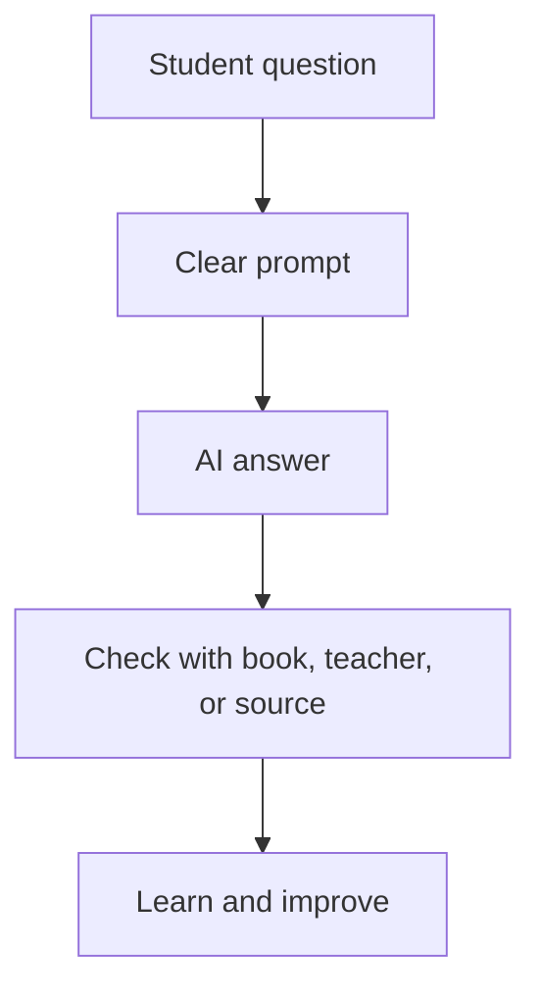

# AI Skillverse 5-Day Student Book

A complete markdown-based learning book for students who missed the AI Skillverse lectures.

Created by Meetoaz Bhardwaj and the AI Skillverse Team.

## What this repository is

This repository is designed like a student-friendly book. It teaches Artificial Intelligence from the ground up through stories, diagrams, activities, tool walkthroughs, prompts, project ideas, safety rules, and exam-preparation methods.

It is built for students from Grade 3 to Grade 12. Younger students can read the story sections, simple explanations, and activities. Older students can go deeper into prompting, research, productivity, presentations, coding support, ethics, bias, hallucinations, and AI-assisted exam preparation.

## Who should use this

| Learner type | How to use the repository |
|---|---|
| Grade 3 to 5 | Read the stories, try simple prompts with adult support, draw diagrams, and do the mini activities. |
| Grade 6 to 8 | Follow the five days in order, complete the activities, and build a small final project. |
| Grade 9 to 12 | Use the senior tracks, exam-preparation workflows, project templates, research guidance, and ethics sections. |
| Parents | Use the parent guide to supervise safe and healthy AI use. |
| Teachers | Use the day-wise structure as a classroom or bootcamp plan. |

## Five-day learning path

| Day | Theme | Main outcome |
|---|---|---|
| Day 1 | Meet AI: Your New Study Partner | Understand what AI is, what it can do, and what it cannot do. |
| Day 2 | Prompt Engineering: How to Ask Better Questions | Learn the prompt formula and practice asking AI for useful answers. |
| Day 3 | AI for Studying, Exams, and Revision | Build study plans, quizzes, flashcards, doubt-clearing systems, and mistake trackers. |
| Day 4 | AI Tools for Projects, Presentations, Research, and Creativity | Use tools like ChatGPT, Copilot, Gemini, DeepSeek, Gamma, NotebookLM, Canva, Napkin AI, and Perplexity responsibly. |
| Day 5 | Ethics, Safety, Future Skills, and Final Showcase | Learn dangers, responsible use, and complete a final AI-assisted project. |

## Recommended reading order

Start here:

1. `book/day-01-meet-ai.md`
2. `book/day-02-prompt-engineering.md`
3. `book/day-03-study-exams-revision.md`
4. `book/day-04-ai-tools-projects.md`
5. `book/day-05-ethics-future-showcase.md`

Then use:

- `support/prompt-library.md` for copy-ready prompts.
- `support/student-safety-and-ethics.md` before using any online tool.
- `resources/tool-index.md` to understand tools.
- `activities/final-project-cards.md` to choose a project.

## Important safety note

AI can be useful, but it is not always correct. Students should not upload personal information, passwords, addresses, school IDs, private photos, private documents, or anything that parents or teachers would not want shared online. Always follow your school rules and ask an adult when unsure.

## Repository map

```text
AI-Skillverse-5-Day-Student-Book/
├── README.md
├── PROMPT_USED.md
├── LICENSE
├── book/
│   ├── day-01-meet-ai.md
│   ├── day-02-prompt-engineering.md
│   ├── day-03-study-exams-revision.md
│   ├── day-04-ai-tools-projects.md
│   └── day-05-ethics-future-showcase.md
├── support/
│   ├── student-safety-and-ethics.md
│   ├── parent-teacher-guide.md
│   ├── glossary.md
│   ├── prompt-library.md
│   ├── project-rubric.md
│   └── faq.md
├── diagrams/
│   ├── how-ai-learns.mmd
│   ├── prompt-engineering-map.mmd
│   ├── ai-study-loop.mmd
│   ├── responsible-ai-flow.mmd
│   └── final-project-journey.mmd
├── activities/
│   ├── day-wise-worksheets.md
│   ├── prompt-practice-cards.md
│   └── final-project-cards.md
├── resources/
│   ├── tool-index.md
│   ├── student-ai-pledge.md
│   └── continuation-roadmap.md
└── assets/
    ├── image1.png
    └── image2.png
```



## Core belief

AI is not a magic homework machine. AI is a thinking partner. It can help you ask better questions, test your understanding, organize ideas, build presentations, and prepare for exams. But your effort, honesty, curiosity, and discipline still matter the most.

## Credit

Made for AI Skillverse students by AI Skillverse Team.
